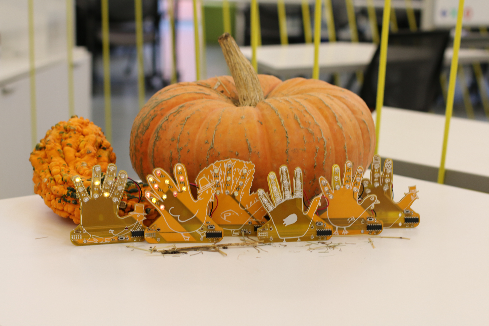
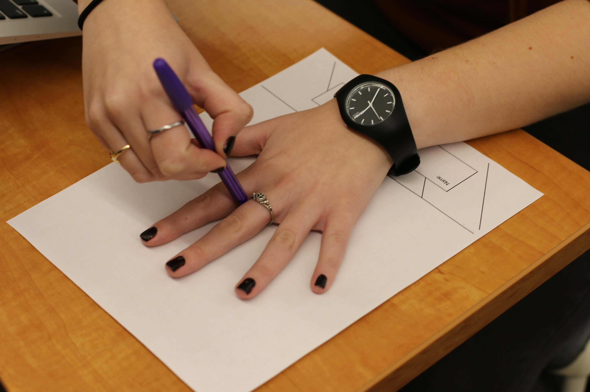

## Thimble Hand Turkey Project
As a fun holiday-themed activity, we took a break in the office to draw grade-school-style hand-turkeys. This project is the result. Feel free to duplicate our work and have some fun making your own!

### Instructions

NOTE: There are slightly more detailed instructions on our [blog](https://blog.thimble.io/happy-thanksgiving-from-thimble-98a42b42d3b0). If you get stuck, ask on our [forums](https://learning.thimble.io/forum/t/happy-thanksgiving/) or send us an email.

Start by printing out the [template PDF file](drawPage.pdf). Then, trace your hand.

Clone or download this repository to your computer.

Scan your drawing into your computer and use [KiCAD](http://kicad-pcb.org/)'s Bitmap2Component tool to import your design to the silkscreen layer. We recommend scaling your design to fit within a 10x10cm square to be able to utilize low-cost rapid PCB prototyping services.

Trace around your hand in KiCAD on the edge cuts layer and move components around to fit your design.

Generate your gerbers and drill files and either make your own printed circuit board or have it manufactured.

Enjoy! Please share your creation with us on social media using our hashtag, #madewiththimble for a chance to win a prize.

For more fun electronics projects visit [our website](https://www.thimble.io/) and make sure to check out our [blog](https://blog.thimble.io/) and [learning platform](https://learning.thimble.io/).
